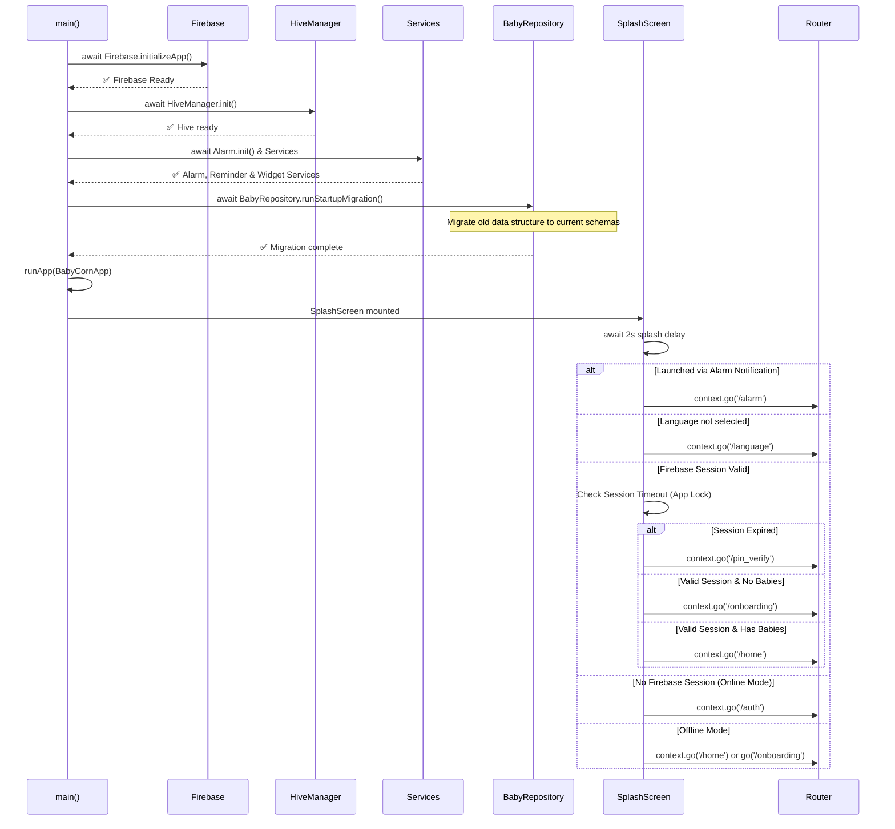

# Baby Corn

> A soft, minimal, offline-first newborn baby tracking and parenting companion app built with Flutter — designed for real parenting moments.

Baby Corn helps parents log feeding sessions, sleep durations, diaper changes, baths, and tummy time — all with a calm, distraction-free experience. The app works completely offline and optionally syncs to the cloud.

---

## ✨ Features

### 🍼 Baby Activity Tracking

| Activity | Details |
|---|---|
| **Feeding** | Log left/right breast feeds or bottle feeds with live timer |
| **Sleep** | Track sleep sessions with a floating overlay timer — visible across all screens |
| **Diaper** | Log wet, dirty, or mixed diaper changes |
| **Bath** | Record bath type, hair washing, and lotion application |
| **Tummy Time** | Track tummy time sessions with duration |

### 📊 Dashboard & Insights

- **Today's Overview** — Daily summary card showing total sleep, feed count, and diaper count
- **Recent Activity Feed** — Scrollable timeline of the last few logged events
- **Baby Age Display** — Automatically shows baby's age in days, weeks, or months
- **Multi-Baby Switcher** — Switch between multiple baby profiles from the home screen

### ⏱️ Live Timer System

- **Floating Timer Overlay** — A persistent, movable overlay window that floats over other apps during active feeding or sleep sessions (Android overlay permission)
- **Active Session Tracking** — Timers persist while navigating across screens
- **Session Guard** — Warns before switching baby profiles when a timer is running

### 📅 Records Timeline & Smart Logging

- Full chronological activity log filterable by activity type
- Detailed metadata per record (duration, side, diaper type, etc.)
- **Smart Record Merging** — Intelligently detects and merges overlapping feed and sleep records (e.g., combines 'Left Breast' and 'Right Breast' if logged consecutively)

### 🔔 Smart Reminders

- Local push notifications powered by `flutter_local_notifications`
- Configurable reminder timing
- Notification channel management per platform

### 🔒 Security & Privacy

- **PIN App Lock** — Set up a PIN to protect the app
- **Biometric Authentication** — Fingerprint / face unlock via `local_auth`
- **Session Timeout** — Configurable auto-lock (Immediately / 1m / 5m / 30m / Never)
- **Secure Local Storage** — Sensitive data stored using `flutter_secure_storage`
- **Screen Security** — Screenshot and screen recording protection via `flutter_windowmanager_plus`
- No unnecessary tracking or third-party analytics by default

### ☁️ Cloud & Backup

- **Google Sign-In** — Optional authentication with Firebase
- **Local Backup / Restore** — Export and import your data as a JSON backup file
- **Background Cloud Sync Engine** — Syncs unsynced records to Firestore with exponential backoff retry logic (configurable via `AppConfig`)
- **Offline-First Architecture** — App is fully functional with no internet connection; cloud sync is optional

### 🎨 App Customization & Social

- **Dark / Light / System Theme** — Full dark mode support
- **Manage Babies** — Add, edit, or remove baby profiles (name, birth date, weight, gender, feeding type)
- **Overlay Permission Toggle** — Enable/disable the floating timer overlay from settings
- **Family Sharing** — Share baby milestones and logs via native SMS directly to contacts

### 🌍 Localization

Supported languages out of the box:

| Language | Code |
|---|---|
| English | `en` |
| Hindi | `hi` |
| Bengali | `bn` |
| Tamil | `ta` |
| Telugu | `te` |
| Kannada | `kn` |

---

## 🧸 Product Vision

Baby Corn is being built to become:

- A **newborn baby tracker** for the first 0–24 months
- A **parenting companion** with guided insights
- A **baby development guide** with milestone tracking
- An **Indian-focused parenting app** with culturally relevant content

---

## 📱 Screens

| Screen | Description |
|---|---|
| **Splash** | App initialization and auth routing |
| **Auth** | Google Sign-In or offline mode |
| **PIN Setup / Verify** | App lock configuration and unlocking |
| **Onboarding** | Baby profile creation wizard |
| **Home (Launchpad)** | Dashboard with quick-log buttons, daily summary, recent activity |
| **Records Timeline** | Full activity log with filters |
| **Feeding Entry** | Log a feeding session with side and duration |
| **Sleep Entry** | Log a sleep session with live timer |
| **Diaper Entry** | Log diaper type |
| **Bath Entry** | Log bath details |
| **Guide** | Parenting hub featuring the 16 Sanskars, Baby Cry Language, and Baby Rashes guides |
| **Statistics** | Activity statistics and trends |
| **Account & Settings** | Profile, theme, PIN, backup, family management |
| **Manage Babies** | Add and manage multiple baby profiles |

---

## 🛠 Tech Stack

### Frontend
- **Flutter** (SDK `>=3.2.0`)
- **Material 3** design system
- **Google Fonts** (`Outfit` family) for premium typography
- **flutter_animate** for smooth micro-animations
- **glassmorphism** for modern UI effects
- **flutter_svg** for scalable vector icons

### State Management
- **Riverpod** (`flutter_riverpod ^2.4.9`) — feature-scoped providers

### Routing
- **GoRouter** (`^17.2.3`) — declarative navigation with deep linking

### Backend (Optional)
- **Firebase Core** — platform initialization
- **Firebase Auth** — Google Sign-In
- **Cloud Firestore** — cloud record storage
- **Firebase Storage** — file and asset storage
- **Firebase Analytics** — usage analytics
- **Firebase Crashlytics** — crash reporting
- **Firebase App Check** — Play Integrity (production) / Debug (development)

### Local Storage
- **Hive** (`^2.2.3`) — fast local NoSQL database for records and sessions
- **flutter_secure_storage** — encrypted storage for PIN, tokens, and settings

### Security & Biometrics
- **local_auth** — fingerprint / face biometric unlock
- **flutter_windowmanager_plus** — screen capture prevention

### Notifications
- **flutter_local_notifications** — local push notifications and reminders

### Utilities
- **connectivity_plus** — network state detection for sync engine
- **geolocator** — location permissions (reserved for future features)
- **image_picker** — baby photo support
- **cached_network_image** — profile photo caching
- **share_plus** — backup sharing
- **file_picker** — backup import
- **uuid** — unique record ID generation
- **intl** — date/time formatting and localization

---

## 🧠 Architecture

Baby Corn follows **Clean Architecture** with a **feature-first folder structure**.

```
lib/
├── core/
│   ├── config/          # AppConfig feature flags (Firebase, sync, auth)
│   ├── constants/       # App constants
│   ├── design/          # Design tokens, layouts, and system
│   ├── local_storage/   # Hive and SecureStorage managers
│   ├── native/          # Native platform integrations
│   ├── providers/       # Global Riverpod providers
│   ├── router/          # GoRouter app navigation
│   ├── services/        # Background services (sync, backup, reminders, biometrics)
│   ├── theme/           # Light/dark theme definitions
│   ├── utils/           # Utility functions and helpers
│   └── widgets/         # Shared global widgets (overlays, lifecycle wrapper)
│
├── features/
│   ├── auth/            # Firebase auth, Google Sign-In, baby model
│   ├── dashboard/       # Home launchpad, main scaffold
│   ├── development/     # Baby development milestones
│   ├── guide/           # Parenting guide content
│   ├── medication/      # Medication dashboard and tracking
│   ├── onboarding/      # Baby profile setup wizard
│   ├── records/         # Activity logging (feeding, sleep, diaper, bath)
│   ├── reminders/       # Reminder creation and management
│   ├── settings/        # Account, theme, PIN, backup, baby management
│   └── statistics/      # Activity stats and charts
│
├── l10n/                # ARB localization files
└── main.dart            # App entry point + overlay entry point
```

### 🚀 Startup Sequence

The startup flow is **strictly sequential** — each step is `await`ed before the next begins. This eliminates race conditions between data migration and routing.



> **Single Source of Truth:** The app intelligently delegates routing based on Firebase Auth state, the local Hive database (`babies_list`), and session expiry status.

### Data Flow

```
User Action → Local Hive Write → Immediate UI Update → Background Cloud Sync (if enabled)
```

### Feature Flags (`AppConfig`)

| Flag | Default | Description |
|---|---|---|
| `enableFirebase` | `true` | Master switch for all Firebase services |
| `enableFirebaseAuth` | `true` | Require Google Sign-In (false = offline-only mode) |
| `enableCloudSync` | `false` | Background Firestore sync engine |
| `enableCloudBackup` | `false` | Cloud backup UI in settings |

---

## 🔄 Sync Engine

The `SyncEngine` runs in the background and syncs unsynced Hive records to Firestore:

- Triggered on app start, network reconnection, and every 5 minutes
- Processes records in batches of 50
- Deduplicates records by ID before syncing
- Implements **exponential backoff** with up to 5 retries on failure
- Fully skipped when `AppConfig.enableCloudSync = false`

---

## 🚀 Getting Started

### Prerequisites

- Flutter SDK `>=3.2.0 <4.0.0`
- Android Studio or VS Code with Flutter extension
- A Firebase project (optional for offline-only mode)
- Android device or emulator (API 21+)

### Installation

```bash
git clone https://github.com/iamPrashanta/baby-corn-apk.git
cd baby-corn-apk
flutter pub get
dart run build_runner build --delete-conflicting-outputs
```

### Firebase Setup (Optional)

If you want cloud features (auth, Firestore sync):

```bash
# Install the Firebase CLI and FlutterFire CLI
dart pub global activate flutterfire_cli

# Configure Firebase for your project
flutterfire configure
```

Then copy `.env.example` to `.env` and fill in your API keys:

```bash
cp .env.example .env
```

To run in **fully offline mode** without Firebase, set in `lib/core/config/app_config.dart`:

```dart
static const bool enableFirebase = false;
static const bool enableFirebaseAuth = false;
```

### Run the App

```bash
flutter run
```

### Build Optimized Release Versions

#### Android (APK)

To build the smallest, most optimized APKs for Android, run:

```bash
flutter build apk --release --split-per-abi --obfuscate --split-debug-info=./debug_info
```

**Which APK should you use?**
The `--split-per-abi` flag will generate multiple APKs in `build/app/outputs/flutter-apk/`. 
- **`app-arm64-v8a-release.apk`**: Use this for 99% of modern Android phones.
- **`app-armeabi-v7a-release.apk`**: Use this for older, 32-bit Android phones.
- **`app-x86_64-release.apk`**: Use this for Android emulators on PC.

> **Note for Windows developers**: See [`docs/android-build-aapt2-windows-fix.md`](docs/android-build-aapt2-windows-fix.md) if you encounter AAPT2 build errors on Windows.

#### iOS (IPA)

To build a release archive for iOS, there are strict prerequisites mandated by Apple.

**Prerequisites to build for iOS:**
1. **A Mac Computer**: Apple strictly requires macOS to compile iOS apps. You cannot build an iOS app on Windows or Linux natively.
2. **Xcode**: Download and install Xcode from the Mac App Store.
3. **Apple Developer Account**: To install the app on a physical iPhone or distribute it, you need an Apple Developer account (a free account allows testing on your own device; a $99/year paid account is required for App Store/TestFlight distribution).
4. **CocoaPods**: Ensure CocoaPods is installed (`sudo gem install cocoapods`) to handle iOS dependencies.

**Build Command:**
Once you are on a Mac and have opened the `ios/Runner.xcworkspace` in Xcode at least once to configure your developer signing certificate, you can run:

```bash
flutter build ipa --obfuscate --split-debug-info=./debug_info
```

This generates an `.xcarchive` and an `.ipa` file located in `build/ios/ipa/`, which you can distribute via TestFlight or upload to the App Store.
---

## 🔑 Permissions (Android)

| Permission | Purpose |
|---|---|
| `SYSTEM_ALERT_WINDOW` | Floating timer overlay over other apps |
| `RECEIVE_BOOT_COMPLETED` | Reschedule reminders after reboot |
| `POST_NOTIFICATIONS` | Local push notifications |
| `USE_BIOMETRIC` | Fingerprint/face app unlock |
| `INTERNET` | Firebase cloud sync |
| `ACCESS_NETWORK_STATE` | Offline/online detection |

---

## 📌 Roadmap

### Planned Features

- [ ] Growth tracking (weight/height charts)
- [ ] Teething tracker
- [ ] Baby development milestone cards
- [ ] AI parenting assistant
- [ ] Family sync & multi-caregiver support
- [ ] Advanced statistics & weekly reports
- [ ] Doctor-ready PDF reports
- [ ] Smart sleep pattern insights
- [ ] 16 Sanskar & Indian parenting guide content
- [ ] Naamkaran & Annaprashan ceremony guidance
- [ ] Premium subscription tier
- [ ] Calling-Messaging-VideoCalling from app to parent or to Doctor


---

## 🤝 Contributing

Contributions, suggestions, and feedback are welcome. Please open an issue or pull request.

---

## 📄 License

MIT License — see [`LICENSE`](LICENSE) for details.

---

## ❤️ Built With Care

Designed for parents, caregivers, and growing families — especially during those quiet 3 AM moments. 🌙
